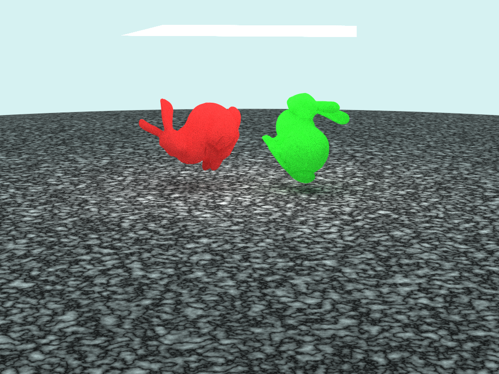

# MyPT



- This is offline renderer for learning rendering algorithms, which include global illuminations, effective techniques (i.e., Next Event Estimation, Bounding Volume Hierarchy, etc...), several integrators (i.e., MLT, Bidirectional path tracing), several sampling strategies.
- If I finished basic learning of path tracing, I'd like to implement GPU path tracing techniques using OptiX or CUDA.
- Currently, this doesn't support spectrum rendering, so all color management is performed by RGB representation.

## Compile & Run (Linux)

- Compile 
```
cd MyPT
mkdir build 
cd build
cmake ..
make
```

- Run
```
cd path/to/MyPT
build/mypt scene.txt
```

- How to render
`Example`
```
filename result/simple.png
# Image resolution
width 1024
height 768
# The number of samples per pixel
spp 8 
# The number of maximum depth to track rays
depth 5
# Background color
background 0.5 0.5 0.5

# Camera settings
beginCamera
origin 0 0 -70
lookat 0 0 0 
up 0 1 0
focus_length 15.0
aperture 0
endCamera

# Ground plane
beginPrimitive 
shape plane min -100 -100 max 100 100
material checker color1 0.3 0.3 0.3 color2 0.9 0.9 0.9
endPrimitive

# Sphere
beginPrimitive
shape sphere 1
translate 0 1 0
maaterial dielectric color 1 1 1 ior 1.5
endPrimitive
```